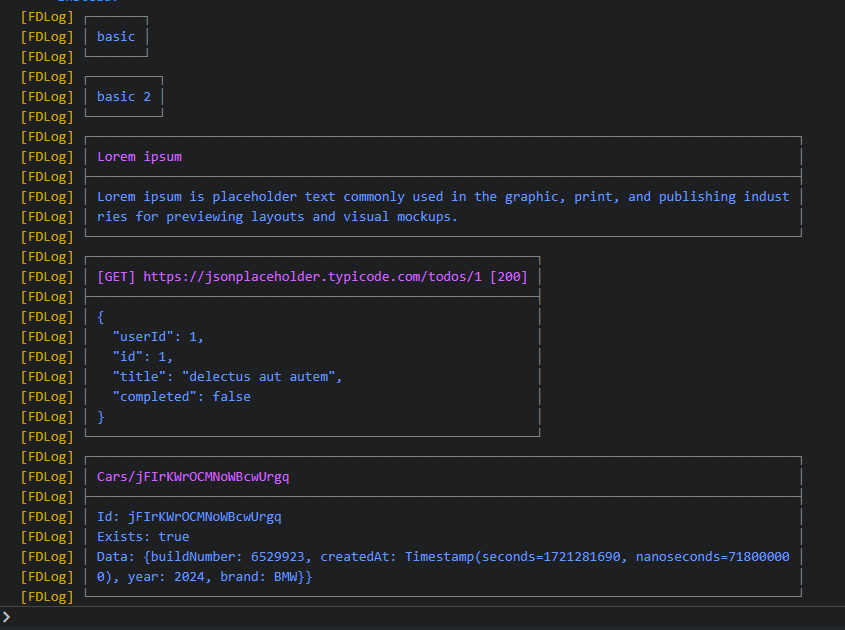
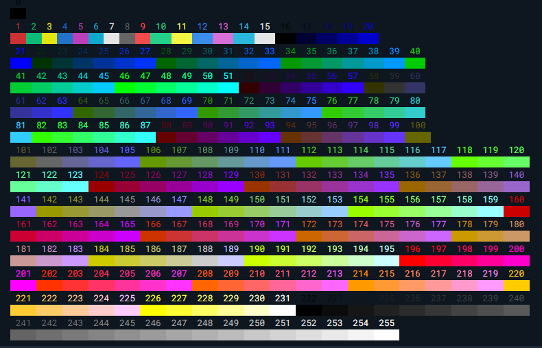

Flutter package for logging with some simple template and customization like to check response from api.

## Features

- Basic

  Simple logging with border like table

- Title

  The basic and additional title/header

- Response Http

  Response api using http package, just put response to this method then you will see the detail about the response

- Result Firestore Document

  Just like response http but for firestore document. If you want to check your response collection, just looping it then use this method. (If using firebase)

- Disable Log

  if your development proses has ended, you can disable log with just set enable as false. this feature better if you use singleton.

## Getting started

- Add this package to your dependency
- Add [http](https://pub.dev/packages/http) pakage if you use
- Add And Setup Your Firebase Project to use some method for check response from firestore

## Usage

```dart
FDLog().basic('basic');

FDLog fdLog = FDLog();
fdLog.basic('basic 2');

fdLog.title(
  'Lorem ipsum',
  'Lorem ipsum is placeholder text commonly used in the graphic, print, and publishing industries for previewing layouts and visual mockups.',
);

String url = 'https://jsonplaceholder.typicode.com/todos/1';
final response = await http.get(Uri.parse(url));
fdLog.response(response);

final doc = await FirebaseFirestore.instance
                    .collection('Cars')
                    .doc('jFIrKWrOCMNoWBcwUrgq')
                    .get();
fdLog.firestoreDocument(doc);
```



### Singleton

You can also use DLog with Singleton Schema, for example with [GetIt](https://pub.dev/packages/get_it) package

```dart
GetIt getIt = GetIt.instance;

initInjection() {
  FDLog fdLog = FDLog(
    bodyColorCode: 49,
    titleColorCode: 50,
    maxCharPerRow: 70,
    prefix: 'Ok',
  );
  getIt.registerLazySingleton(() => fdLog);
}

void main()  {
  initInjection();
  runApp(const MyApp());
}

ElevatedButton(
  onPressed: () {
    getIt<FDLog>().title('Dependency Injection', 'Service Locator');
  },
  child: const Text('GetIt'),
),
```


### Color Code:

- Ordered

  

- Palette

  

## Additional information

You can see the tutorial from: [Flutter Delux](https://www.youtube.com/@flutterdelux)
